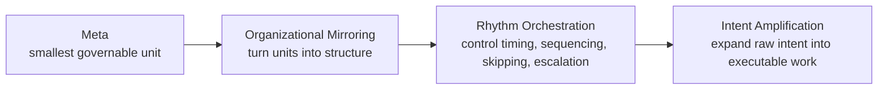
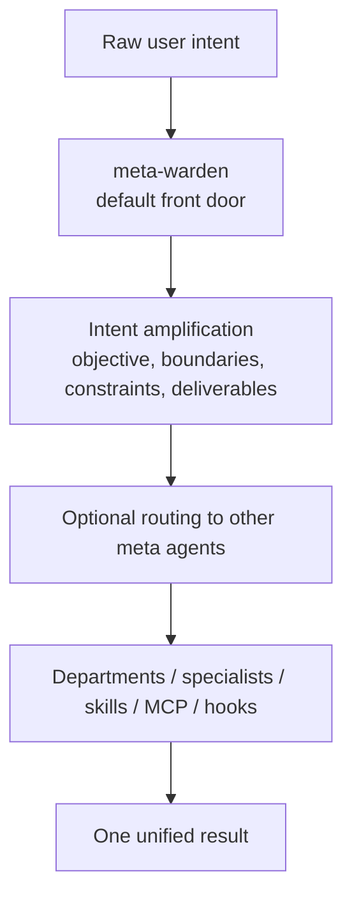

<div align="center">

<h1>Meta_Kim</h1>

<p>
  <a href="README.md">English</a> |
  <a href="README.zh-CN.md">简体中文</a>
</p>

<p>
  
  
  
</p>

**An open-source meta-architecture for intent amplification across Claude Code, Codex, and OpenClaw**

Meta_Kim is about teaching AI systems to organize complex work before they answer.

**Meta -> Organizational Mirroring -> Rhythm Orchestration -> Intent Amplification**

</div>

## Author and Support

<div align="center">
  
  <p>
    GitHub <a href="https://github.com/KimYx0207">KimYx0207</a> |
    𝕏 <a href="https://x.com/KimYx0207">@KimYx0207</a> |
    Website <a href="https://www.aiking.dev/">aiking.dev</a> |
    WeChat Official Account: <strong>老金带你玩AI</strong>
  </p>
  <p>
    Feishu knowledge base:
    <a href="https://my.feishu.cn/wiki/OhQ8wqntFihcI1kWVDlcNdpznFf">ongoing updates</a>
  </p>
</div>

<div align="center">
  <table align="center">
    <tr>
      <td align="center">
        
        <br/>
        <strong>WeChat Pay</strong>
      </td>
      <td align="center">
        
        <br/>
        <strong>Alipay</strong>
      </td>
    </tr>
  </table>
</div>

## At a Glance

- Default front door: `meta-warden`
- Organizational backbone: `8` meta agents
- Industry layer: `20` industries, `100` department agents, `1000` specialists
- Supported runtimes: Claude Code, Codex, OpenClaw
- Primary behavior: amplify intent first, then execute and coordinate

## What This Project Is

Meta_Kim is not a chatbot product, not a SaaS app, not a single giant prompt, and not a folder full of disconnected agent files.

It is an engineering system built around one idea:

**raw intent should be amplified into executable work before the system starts answering.**

That means:

- the user starts with intent, not a finished specification
- the system first clarifies objective, boundaries, constraints, and deliverables
- work is routed through governable units instead of one giant undifferentiated context
- the same underlying discipline holds across Claude Code, Codex, and OpenClaw

At the engineering level, it organizes:

- `agents`: responsibility boundaries and organizational roles
- `skills`: reusable capability blocks
- `MCP`: external capability interfaces
- `hooks`: runtime rules and automation interception
- `memory`: long-term continuity and context policy
- `workspaces`: local runtime operating spaces
- `sync / validate / eval`: synchronization, validation, and acceptance tooling

## The Meta Philosophy

In Meta_Kim:

**meta = the smallest governable unit that exists to support intent amplification**

A valid meta unit must be:

- independently understandable
- small enough to stay controllable
- explicit about what it owns and refuses
- replaceable without collapsing the whole system
- reusable across workflows

Meta is an architectural unit here, not decoration.

## Core Method

Meta_Kim is built around one chain:

**Meta -> Organizational Mirroring -> Rhythm Orchestration -> Intent Amplification**



Each part solves a different problem:

- `Meta`: decomposition
- `Organizational Mirroring`: structure
- `Rhythm Orchestration`: timing and routing
- `Intent Amplification`: completion

## How the System Works

The default path is not “user asks -> model answers”.

It is:



The user-facing default is:

- `meta-warden`

The other seven meta agents are internal structure, not the public menu.

## The Eight Meta Agents

- `meta-warden`: default entry, arbitration, synthesis
- `meta-conductor`: orchestration, sequencing, rhythm control
- `meta-genesis`: prompt identity, persona, `SOUL.md`
- `meta-artisan`: skills, MCP, tool and capability fit
- `meta-sentinel`: hooks, safety, permissions, rollback
- `meta-librarian`: memory, continuity, context policy
- `meta-prism`: quality review, drift detection, anti-slop checks
- `meta-scout`: external capability discovery and evaluation

## Runtime Entry Points

Meta_Kim keeps one operating logic while letting each runtime use its native interface.

| Runtime | Entry point | Main repo surface | Purpose |
| --- | --- | --- | --- |
| Claude Code | `CLAUDE.md` | `.claude/`, `.mcp.json` | Canonical editing runtime for meta agents, skills, hooks, and MCP |
| Codex | `AGENTS.md` | `.codex/`, `.agents/`, `codex/config.toml.example` | Codex-native agent and skill projection |
| OpenClaw | `openclaw/workspaces/` | `openclaw/` | Local workspace agents and template config with the same governance logic |

## How To Use It

### Default trigger

The safest way to invoke the system is to route through the default front door.

Example:

```text
Use meta-warden as the entry point. Amplify the intent first, then decide which meta agents are needed.
```

### When to name a specialist meta agent

- prompt identity or `SOUL.md`: `meta-genesis`
- skills, MCP, tool selection: `meta-artisan`
- hooks, permissions, rollback, safety: `meta-sentinel`
- memory and long-term context: `meta-librarian`
- workflow and timing: `meta-conductor`
- quality review: `meta-prism`
- external tools and ecosystem scan: `meta-scout`

### In Claude Code

Claude Code reads:

- `CLAUDE.md`
- `.claude/agents/`
- `.claude/skills/`
- `.mcp.json`

Example:

```text
Use meta-warden as the entry point, amplify the intent, then review this project architecture and propose next steps.
```

### In Codex

Codex reads:

- `AGENTS.md`
- `.codex/agents/`
- `.agents/skills/`

If you want local MCP wiring as well, use:

- `codex/config.toml.example`

### In OpenClaw

Prepare local state first:

```bash
npm install
npm run prepare:openclaw-local
```

Then run an agent directly:

```bash
openclaw agent --local --agent meta-warden --message "Amplify the intent first, then decide which meta agents to route to." --json --timeout 120
```

## Repository Structure

```text
Meta_Kim/
├─ .claude/        Canonical Claude Code source: agents, skills, hooks, settings
├─ .codex/         Codex-native agent and skill mirrors
├─ .agents/        Codex project-level skill mirror
├─ codex/          Codex global config example
├─ openclaw/       OpenClaw workspaces, template config, runtime mirrors
├─ factory/        Published industry library and runtime import packs
├─ images/         Public assets used by the README
├─ scripts/        Sync, validation, MCP, evaluation, OpenClaw helper scripts
├─ shared-skills/  Shared skill mirrors across runtimes
├─ AGENTS.md       Codex and cross-runtime guide
├─ CLAUDE.md       Claude Code guide
├─ .mcp.json       Claude Code project MCP entry
├─ README.md       English README
└─ README.zh-CN.md Chinese README
```

Local-only ignored folders are not part of the public release surface:

- `meta/`
- `image/`
- `node_modules/`

### Why There Is a `codex/` Folder

Codex uses two configuration layers:

- repo-local assets, which live in `.codex/` and `.agents/`
- user-global configuration, which cannot live directly inside the repository root

So:

- `.codex/` is the repo content Codex reads directly
- `codex/` is only the example directory for wiring `~/.codex/config.toml`

## What Is Inside `factory/`

`factory/` contains release assets and machine-readable indexes for the industry library.

### Primary release directories

- `factory/agent-library/`
  - the full human-readable library
  - `100` department agents
  - `1000` specialist agents
- `factory/flagship-complete/`
  - `20` hand-polished flagship agents
- `factory/runtime-packs/`
  - Claude Code / Codex / OpenClaw import packs
  - `1100` runtime-pack entries

### Machine-readable indexes

- `factory/organization-map.json`
- `factory/department-call-protocol.json`
- `factory/agent-library/agent-index.json`
- `factory/flagship-complete/index.json`
- `factory/flagship-complete/summary.json`
- `factory/runtime-packs/summary.json`

### Covered industries

- Game
- Internet
- Finance
- AI
- Healthcare
- Stocks
- Investment
- Web3
- Media
- Ecommerce
- Education
- Legal
- Manufacturing
- Logistics
- Real Estate
- Energy
- Automotive
- Travel & Hospitality
- Biotech
- Public Sector

### Department archetypes

- `strategy-office`
- `growth-operations`
- `product-delivery`
- `risk-compliance`
- `research-intelligence`

## Commands

### `npm install`

Run this after cloning if you want to use or validate the repo locally.

### `npm run sync:runtimes`

Run this after changing canonical agents, skills, or runtime-facing config. It rebuilds the runtime mirrors for Claude Code, Codex, and OpenClaw.

### `npm run prepare:openclaw-local`

Run this only if you want to execute the OpenClaw side on your own machine.

### `npm run verify:all`

Run this before publishing, shipping, or after substantial runtime changes. It performs the full validation and acceptance pass.

## Simplest Starting Path

If you only want to understand the project:

- read `README.md`
- read `CLAUDE.md`
- read `AGENTS.md`

If you want to verify that the repo is real and runnable:

```bash
npm install
npm run sync:runtimes
npm run verify:all
```

If you want to inspect the industry layer directly:

- `factory/agent-library/`
- `factory/flagship-complete/agents/`
- `factory/runtime-packs/`

## Paper and Method Basis

The methodological basis comes from the evaluation work on meta-based intent amplification.

- Paper: <https://zenodo.org/records/18957649>
- DOI: `10.5281/zenodo.18957649`

The paper explains the method.  
This repository turns that method into runtime-ready engineering assets.

## License

This project is released under [CC BY 4.0](https://creativecommons.org/licenses/by/4.0/).

You may share and adapt it as long as attribution is preserved and changes are clearly marked.
