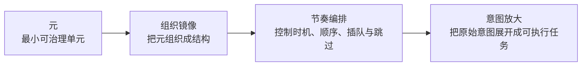
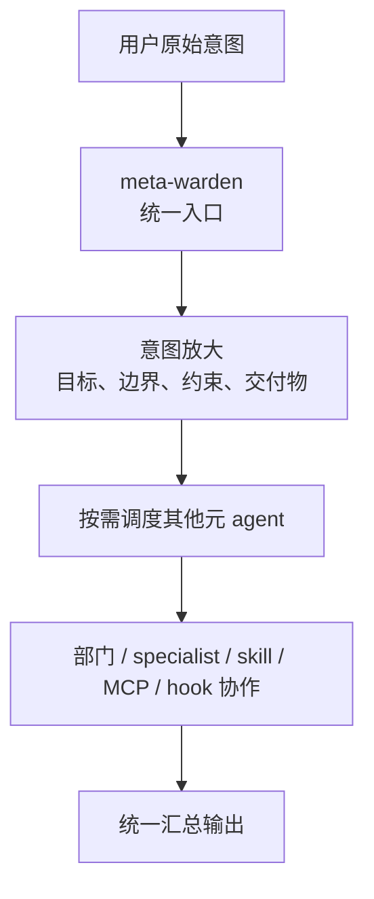

<div align="center">

<h1>Meta_Kim</h1>

<p>
  <a href="README.md">English</a> |
  <a href="README.zh-CN.md">简体中文</a>
</p>

<p>
  
  
  
</p>

**跨 Claude Code / Codex / OpenClaw 的意图放大元架构工程**

Meta_Kim 不是教 AI 多说，而是教 AI 先学会组织复杂任务。

**元 -> 组织镜像 -> 节奏编排 -> 意图放大**

</div>

## 作者与支持

<div align="center">
  
  <p>
    GitHub <a href="https://github.com/KimYx0207">KimYx0207</a> |
    𝕏 <a href="https://x.com/KimYx0207">@KimYx0207</a> |
    官网 <a href="https://www.aiking.dev/">aiking.dev</a> |
    微信公众号：<strong>老金带你玩AI</strong>
  </p>
  <p>
    飞书知识库：
    <a href="https://my.feishu.cn/wiki/OhQ8wqntFihcI1kWVDlcNdpznFf">长期更新入口</a>
  </p>
</div>

<div align="center">
  <table align="center">
    <tr>
      <td align="center">
        
        <br/>
        <strong>微信支付</strong>
      </td>
      <td align="center">
        
        <br/>
        <strong>支付宝</strong>
      </td>
    </tr>
  </table>
</div>

## 一眼看懂

- 默认入口：`meta-warden`
- 组织骨架：`8` 个元 agent
- 行业层：`20` 个行业、`100` 个部门 agent、`1000` 个 specialist
- 运行时：Claude Code、Codex、OpenClaw
- 目标：先做意图放大，再做执行与协作

## 这是什么项目

Meta_Kim 不是聊天产品，不是 SaaS，不是一个“大 prompt”，也不是把很多 agent 文件堆在一起。

它是一套跨运行时的工程化方法：

- 用户先给出原始意图
- 系统先做意图放大，而不是直接急着回答
- 系统按元架构决定该拆给谁、该跳过什么、该先做什么
- 最后在 Claude Code、Codex、OpenClaw 三个运行时里保持同一套底层规矩

工程上它同时组织这些层：

- `agent`：职责边界和组织角色
- `skill`：可复用能力块
- `MCP`：外部能力接口
- `hook`：运行时约束和自动化拦截
- `memory`：长期上下文与连续性
- `workspace`：运行时本地工作空间
- `sync / validate / eval`：同步、校验、验收工具链

一句话说：

**Meta_Kim 关心的不是“单次答得像不像”，而是“复杂任务能不能被持续、稳定、可治理地完成”。**

## 元的理念

在 Meta_Kim 里：

**元 = 为了支持意图放大而存在的最小可治理单元。**

它至少要满足五个条件：

- 能独立理解
- 足够小，便于控制
- 边界清晰，知道自己不负责什么
- 可替换，不会一换就让系统整体塌掉
- 可复用，能被重复编排

Meta_Kim 不把“元”当修辞，而是把它当架构粒度。

## 方法主线

Meta_Kim 的核心链路只有一条：

**元 -> 组织镜像 -> 节奏编排 -> 意图放大**



这四段分别解决四个问题：

- `元`：怎么拆
- `组织镜像`：怎么组
- `节奏编排`：怎么发
- `意图放大`：怎么成

缺任何一段，这套方法都不完整。

## 系统怎么工作

默认工作路径不是“用户提问 -> 直接生成”。

而是：



默认前门只有一个：

- `meta-warden`

其它 7 个元 agent 是后台结构，不是面向用户的菜单。

## 8 个元 agent

- `meta-warden`：统一入口、统筹、仲裁、最终汇总
- `meta-conductor`：编排、调度、节奏控制
- `meta-genesis`：人格、提示词、`SOUL.md`
- `meta-artisan`：skill、MCP、工具与能力匹配
- `meta-sentinel`：hook、安全、权限、回滚
- `meta-librarian`：记忆、知识连续性、上下文策略
- `meta-prism`：质量审查、漂移检测、反 AI 套话
- `meta-scout`：外部能力发现与评估

如果你第一次接触这个项目，只需要先记住：

**默认入口是 `meta-warden`。**

## 三个运行时怎么承接

Meta_Kim 不是强行把三个运行时做成一模一样。

它做的是：

- 保持同一套底层方法
- 用每个运行时自己的原生结构去承接它

| 运行时 | 用户入口 | 仓库落点 | 作用 |
| --- | --- | --- | --- |
| Claude Code | `CLAUDE.md` | `.claude/`、`.mcp.json` | 元 agent、skill、hook、MCP 的主源运行时 |
| Codex | `AGENTS.md` | `.codex/`、`.agents/`、`codex/config.toml.example` | Codex 原生 agent / skill 镜像 |
| OpenClaw | `openclaw/workspaces/` | `openclaw/` | OpenClaw 的本地 workspace agent 和模板配置 |

## 怎么用，怎么触发

### 默认触发方式

如果你想用这套系统，最稳的方式就是直接让它走统一入口。

示例：

```text
请以 meta-warden 为统一入口，先做意图放大，再判断是否需要调用其他元 agent。
```

### 什么时候显式点名其他元 agent

- 你要定义 prompt / persona / `SOUL.md`：点 `meta-genesis`
- 你要做 skill / MCP / 工具匹配：点 `meta-artisan`
- 你要处理 hook / 安全 / 权限 / 回滚：点 `meta-sentinel`
- 你要处理记忆和长期上下文：点 `meta-librarian`
- 你要处理流程编排和节奏：点 `meta-conductor`
- 你要做质量审查：点 `meta-prism`
- 你要找外部能力、外部工具：点 `meta-scout`

### 在 Claude Code 里怎么用

1. 用 Claude Code 打开仓库
2. Claude Code 会读取：
   - `CLAUDE.md`
   - `.claude/agents/`
   - `.claude/skills/`
   - `.mcp.json`
3. 直接发起任务，例如：

```text
请以 meta-warden 为统一入口，审查这个项目的架构，并给出下一步方案。
```

### 在 Codex 里怎么用

1. 用 Codex 打开仓库
2. Codex 会读取：
   - `AGENTS.md`
   - `.codex/agents/`
   - `.agents/skills/`
3. 如果要接本地 MCP，再参考：
   - `codex/config.toml.example`

### 在 OpenClaw 里怎么用

1. 先准备本地环境：

```bash
npm install
npm run prepare:openclaw-local
```

2. 然后直接运行某个元 agent，例如：

```bash
openclaw agent --local --agent meta-warden --message "请先做意图放大，再决定该调哪些元 agent" --json --timeout 120
```

## 项目结构

```text
Meta_Kim/
├─ .claude/        Claude Code 主源：agents、skills、hooks、settings
├─ .codex/         Codex 仓库内 agents 与 skills 镜像
├─ .agents/        Codex 项目级 skills 镜像
├─ codex/          Codex 全局配置示例
├─ openclaw/       OpenClaw workspace、模板配置、运行时镜像
├─ factory/        发布版行业 agent 层与三端导入包
├─ images/         README 使用的公开图片资源
├─ scripts/        同步、校验、MCP、自检、OpenClaw 准备脚本
├─ shared-skills/  跨运行时共享技能镜像
├─ AGENTS.md       Codex / 跨运行时入口说明
├─ CLAUDE.md       Claude Code 入口说明
├─ .mcp.json       Claude Code 项目级 MCP 配置
├─ README.md       英文主 README
└─ README.zh-CN.md 中文 README
```

本地私有目录不属于公开发布面：

- `meta/`：作者本地研究稿与文章目录，已忽略
- `image/`：本地截图和临时导出目录，已忽略
- `node_modules/`：本地依赖目录，已忽略

### 为什么会有 `codex/`

Codex 的配置分两层：

- 仓库内资产：放在 `.codex/` 和 `.agents/`
- 用户电脑里的全局配置：不能直接写进仓库根部

所以：

- `.codex/` 是 Codex 真正会直接读取的仓库内内容
- `codex/` 只是一个配置示例目录，用来说明 `~/.codex/config.toml` 应该怎么接

## `factory/` 里到底有什么

`factory/` 仅包含发布资产和机器索引。

### 三个主目录

- `factory/agent-library/`
  - 完整人类可读库
  - 包含 `100` 个部门 agent 和 `1000` 个 specialist agent
- `factory/flagship-complete/`
  - `20` 个旗舰 agent 成品层
- `factory/runtime-packs/`
  - Claude Code / Codex / OpenClaw 三端导入包
  - 总计 `1100` 个运行时包

### 机器索引

- `factory/organization-map.json`
  - 完整组织图
- `factory/department-call-protocol.json`
  - 默认路由与 handoff 规则
- `factory/agent-library/agent-index.json`
  - 全量 agent 索引
- `factory/flagship-complete/index.json`
  - 20 个旗舰索引
- `factory/flagship-complete/summary.json`
  - 旗舰总包统计
- `factory/runtime-packs/summary.json`
  - 三端运行时总包统计

### 行业覆盖

当前行业层覆盖：

- 游戏
- 互联网
- 金融
- AI
- 医疗
- 股票
- 投资
- Web3
- 自媒体
- 电商
- 教育
- 法律
- 制造
- 物流
- 房地产
- 能源
- 汽车
- 旅游与酒店
- 生物科技
- 公共部门

每个行业统一使用 5 类部门模板：

- `strategy-office`
- `growth-operations`
- `product-delivery`
- `risk-compliance`
- `research-intelligence`

## 这些命令什么时候要跑

### `npm install`

第一次拉项目到本地，准备使用或验证时执行。

### `npm run sync:runtimes`

你改了主源 agent、skill、运行时配置之后执行。  
作用是把主源重新同步成 Claude Code / Codex / OpenClaw 三端镜像。

### `npm run prepare:openclaw-local`

只有你准备在本机真正跑 OpenClaw 时才需要。  
作用是补 OpenClaw 本地授权和状态准备。

### `npm run verify:all`

准备发布、提交、开源，或者刚改完运行时资产时执行。  
作用是统一做校验和验收。

## 最简单的开始方式

### 只是想了解项目

先读这三个文件：

- `README.md`
- `CLAUDE.md`
- `AGENTS.md`

### 想验证项目可运行

在仓库根目录执行：

```bash
npm install
npm run sync:runtimes
npm run verify:all
```

### 想看已经做好的行业 agent

直接看：

- `factory/agent-library/`
- `factory/flagship-complete/agents/`
- `factory/runtime-packs/`

## 方法依据与论文

Meta_Kim 的方法依据来自“基于元的意图放大”评测与方法沉淀。

- 论文页面：<https://zenodo.org/records/18957649>
- DOI：`10.5281/zenodo.18957649`

论文负责解释方法论基础。  
本仓库负责把这套方法落成可运行的工程资产。

## License

本项目采用 [CC BY 4.0](https://creativecommons.org/licenses/by/4.0/) 许可协议。

你可以分享、改编、再发布，但需要保留署名并标注修改。
